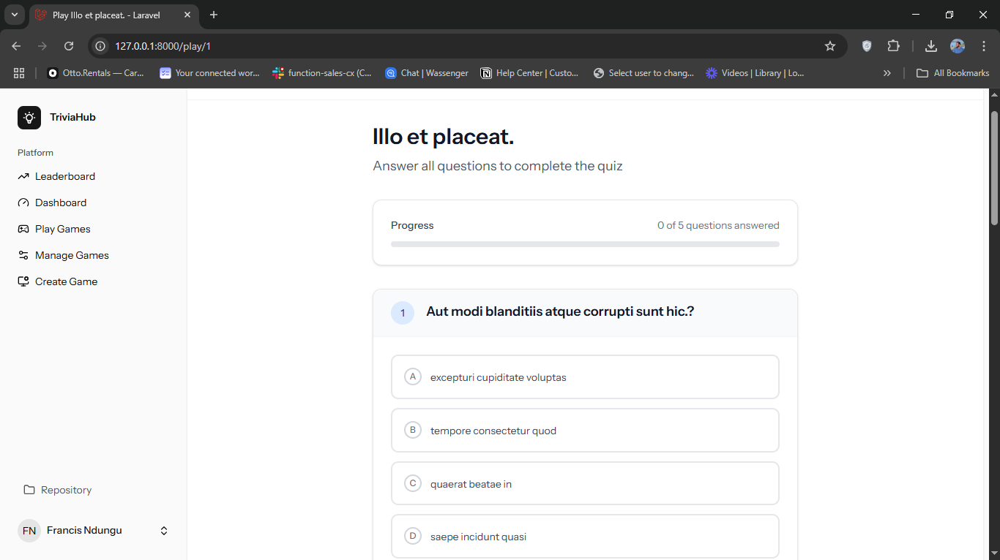

# TriviaHub

TriviaHub is a full-stack gamified trivia platform built with Laravel + Inertia + React. Users can create and manage trivia games, invite others to play via email, take quizzes, and view leaderboards — all within a sleek, responsive UI.

---

## Features

- User authentication (Laravel Breeze + Sanctum)
- Trivia game creation with dynamic question builder
- Multiple choice questions with one correct answer
- Invite players by email with tokenized links
- Fully interactive quiz gameplay (`/play/{game}`)
- Score evaluation + leaderboard
- Dashboard to track personal quiz history
- Clean sidebar navigation and responsive UI
- Full database seeding for demo setup

---

## Tech Stack

| Layer         | Technology               |
| ------------- | ------------------------ |
| Backend       | Laravel 12 (Monolith)    |
| Frontend      | React + Inertia.js       |
| Auth          | Laravel Breeze + Sanctum |
| Database      | PostgreSQL (or MySQL)    |
| Styling       | Tailwind CSS             |
| Icons         | Lucide Icons             |
| Mail Delivery | Laravel Mail + Mailtrap  |

---

## Setup Instructions

1. Clone the repo
2. Run `composer install && npm install`
3. Configure your `.env` file (DB + Mailtrap)
4. Run migrations and seeders:

    ```
    php artisan migrate:fresh --seed
    ```

5. Start the server:

    ```
    composer run dev
    ```

---

## Folder Structure (Key Parts)

```
/app
  /Http/Controllers
  /Models
/database
  /seeders
  /factories
/resources
  /js/pages/...
  /views/emails/invitation.blade.php
```

---

## Database Schema Overview

- **users**
- **games**
- **questions**
- **choices**
- **quiz_attempts**
- **invitations**


Relationships:

- A user has many games
- A game has many questions
- A question has many choices
- A user can have many quiz_attempts
- Invitations store token-based email access

---

## Routes Overview

| Method | URI                   | Purpose                   |
| ------ | --------------------- | ------------------------- |
| GET    | /games                | Game list / management    |
| POST   | /games                | Create game               |
| GET    | /games/{id}/questions | Manage questions view     |
| POST   | /games/{id}/questions | Add question + choices    |
| GET    | /play                 | Game selection view       |
| GET    | /play/{game}          | Start quiz                |
| POST   | /play/{game}          | Submit quiz, score result |
| GET    | /leaderboard          | Global leaderboard        |
| GET    | /games/{game}/invite  | Invite form               |
| POST   | /games/{game}/invite  | Store + send invite       |
| GET    | /invitation/{token}   | Token access to game      |

---

## Seeder Details

- `UserSeeder`: Creates demo users
- `GameSeeder`: 2 games per user
- `QuestionSeeder`: 5 questions per game
- `ChoiceSeeder`: 4 choices per question
- `QuizAttemptSeeder`: Random quiz scores per user/game

Use this to spin up a working demo:

```bash
php artisan migrate:fresh --seed
```

---

## Email Invites

Sent using Laravel Mail + Mailtrap.  
Email includes a secure token link to join the game as a guest.
Disclaimer: Mailtrap only sends emails to the owner only

---

## Screenshots





---

## License

This project is open-source under the MIT License.
